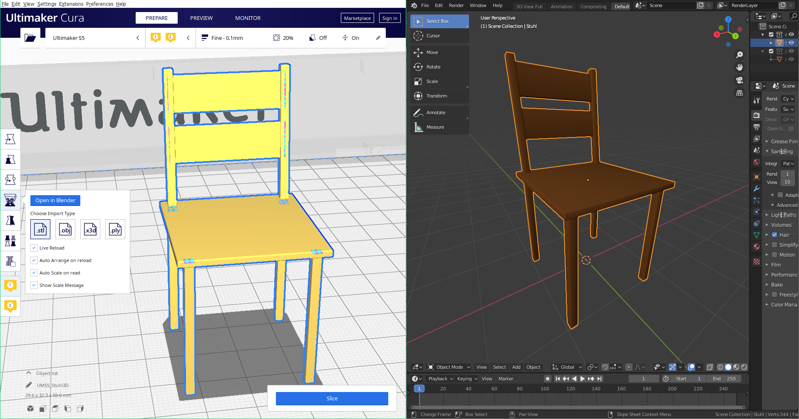
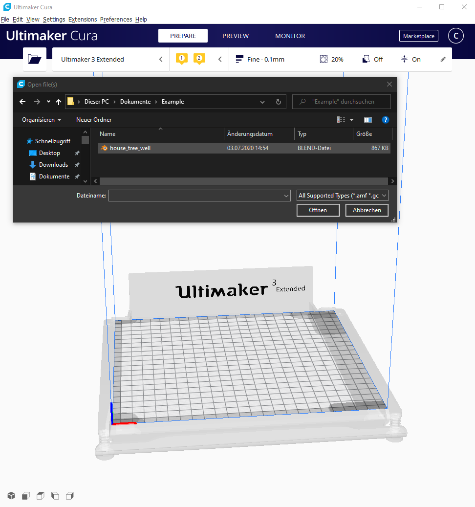
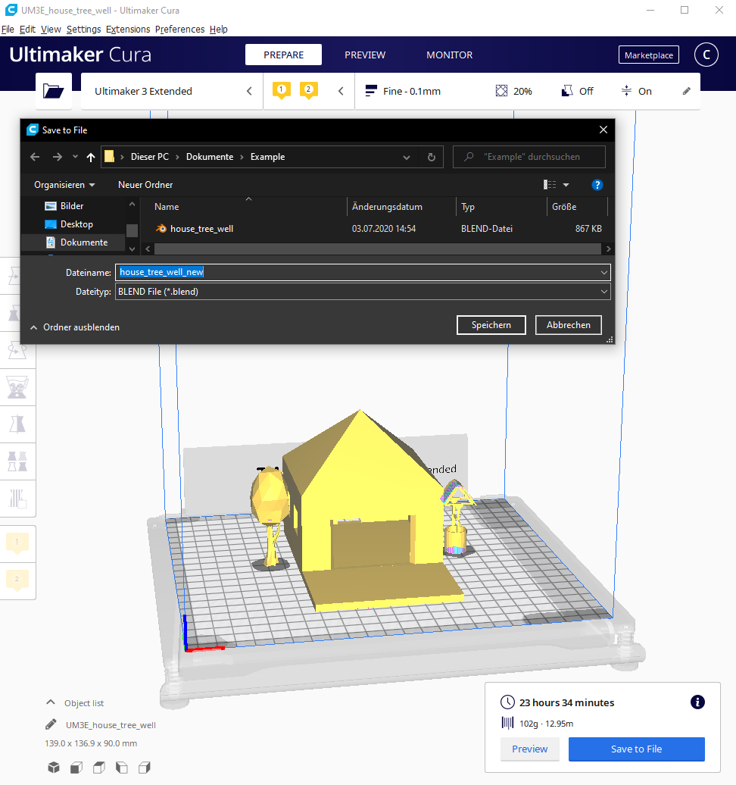

 <strong> Authors: </strong> Alexander Wiegel & Yusuf Ay 

# Blender Manual 

 

## Table of contents
- [1. Installation](#1-Installation)
- [2. Functionality / Usage](#2-Functionality-/-Usage)

 

## 1. Installation
To install this plugin, simply drag this folder unzipped into your plugins folder.

The following tool is needed for this plugin to work:
* **Blender** (https://www.blender.org/download/) (**2.80 or higher** is required)

 

## 2. Functionality / Usage
**Default functionality:**
* **BLENDReader:** Provides support for reading BLEND files. \
To open a BLEND file, simply press on `Open file(s)` or drag the desired file into the cura window.
If it's the first use time, the plugin tries to find the path to blender. If not successful, a file explorer window will open up, where the user can set the path to blender manually.
If the BLEND file contains multiple objects, all objects will be loaded separately.

* **BLENDWriter:** Provides support for writing BLEND files. The objects inside the BLEND file are evenly distributed along the x-axis. \
To save the current build plate in a BLEND file, press `Slice` on the bottom right corner and then `Save to File`.
Objects can be single objects (one object per BLEND file) or multiple objects (multiple objects per BLEND file).
The user can also load a BLEND file with multiple objects and delete some. Only the objects remained on the current build plate will be written to the BLEND file.
Foreign files (stl, obj, x3d, ply) can also be written to a BLEND file.
Any combination of those objects/files will work.

**Functionality accessed through the toolbar:** \
 
To use the tool of this plugin, load an object from a file and click on it. A toolbar on the left side of the window will appear.
Click on the logo of this plugin. \
There are multiple options available:
* **Open in Blender:**
Opens the currently selected object in blender and also creates a file watcher for this file.
If the object inside blender will be changed and saved, cura automatically updates the corresponding object in cura.
* **Select Import Type:**
Blender files get converted into another file type on reading/writing. Select one of four types for this (stl, obj, x3d, ply).

**Functions that can be turned on/off:**
* **Live Reload:** Changing a loaded object in blender and saving it, automatically reloads the object inside cura.
* **Auto arrange on reload:** After an object gets reloaded through the 'Live Reload' function, auto arranges the complete build plate.
* **Auto scale on read:** If object is either too big or too small, scales it down/up automatically to fit the build plate.
* **Show scale message:** Shows or hides the auto scale message.

Inside the plugins folder `plugins/Blender` the user can find a settings file `blender_settings.json`. 
Changing settings inside the toolbar will permanently save those settings inside the settings file.
The next time the user starts cura, those settings will be loaded.

**Information:** If the path where Ultimaker Cura is installed is protected, the user either needs to give this settings file write permission or needs to start cura with administrator privileges. Another option is to modify the settings file manually. \
**Quick tip:** Execute cura as administrator on the first time using this plugin and set the desired settings.

**Example Workflow:** \
The picture below shows an example of how the workflow with this plugin could look like. \

     

**Open/Save BLEND files:** \
The pictures below show how to open/save BLEND files. \

