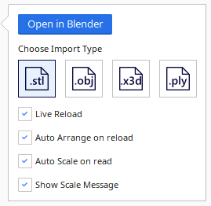
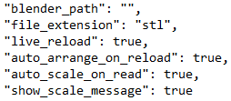
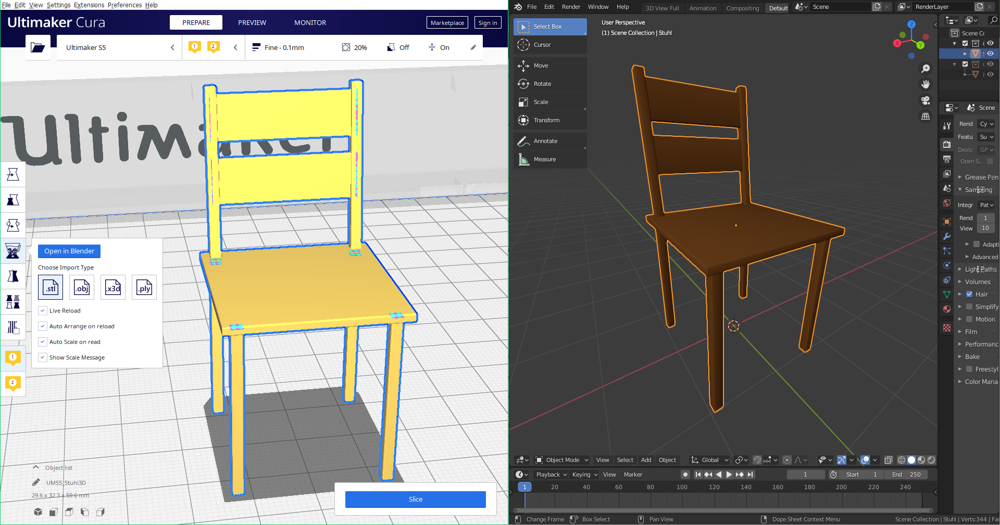

 <strong> Authors: </strong> Alexander Wiegel & Yusuf Ay 

# Blender 
This Plugin provides support for reading/writing BLEND files directly without importing/exporting. \
It also offers extra features that are described in this document.

 

## Table of contents
- [1. Installation](#1-Installation)
- [2. Functionality / Usage](#2-Functionality-/-Usage)
- [3. Explanation of all files](#3-Explanation-of-all-files)
- [4. Potential problems](#4-Potential-problems)
- [5. Design decisions](#5-Design-decisions)

 

## 1. Installation
To install this plugin, simply drag this folder unzipped into your plugins folder.

The following tools are needed for this plugin to work:
* Blender (https://www.blender.org/download/)
* Python  (https://www.python.org/downloads/)

 

## 2. Functionality / Usage
**Default functionality:**
* **BLENDReader:** Provides support for reading BLEND files. \
To open a BLEND file, simply press on `Open file(s)` or drag the desired file into the cura window.
If it's the first use time, the plugin tries to find the path to blender. If not successful, a file explorer window will open up, where the user can set the path to blender manually.
If the BLEND file contains multiple objects, all objects will be loaded separately.

* **BLENDWriter:** Provides support for writing BLEND files. The objects inside the BLEND file are evenly distributed along the x-axis. \
To save the current build plate in a BLEND file, press `Slice` on the bottom right corner and then `Save to File`.
Objects can be single objects (one object per BLEND file) or multiple objects (multiple objects per BLEND file).
The user can also load a BLEND file with multiple objects and delete some. Only the objects remained on the current build plate will be written to the BLEND file.
Foreign files (stl, obj, x3d, ply) can also be written to a BLEND file.
Any combination of those objects/files will work.

**Functionality accessed through the toolbar:** \
 
To use the tool of this plugin, load an object from a file and click on it. A toolbar on the left side of the window will appear.
Click on the logo of this plugin. \
There are multiple options available:
* **Open in Blender:**
Opens the currently selected object in blender and also creates a file watcher for this file.
If the object inside blender will be changed and saved, cura automatically updates the corresponding object in cura.
* **Select Import Type:**
Blender files get converted into another file type on reading/writing. Select one of four types for this (stl, obj, x3d, ply).

**Functions that can be turned on/off:**
* **Live Reload:** Changing a loaded object in blender and saving it, automatically reloads the object inside cura.
* **Auto arrange on reload:** After an object gets reloaded through the 'Live Reload' function, auto arranges the complete build plate.
* **Auto scale on read:** If object is either too big or too small, scales it down/up automatically to fit the build plate.
* **Show scale message:** Shows or hides the auto scale message.

Inside the plugins folder `plugins/Blender` the user can find a settings file `blender_settings.json`. 
Changing settings inside the toolbar will permanently save those settings inside the settings file.
The next time the user starts cura, those settings will be loaded.

**Information:** If the path where Ultimaker Cura is installed is protected, the user either needs to give this settings file write permission or needs to start cura with administrator privileges. Another option is to modify the settings file manually. \
**Quick tip:** Execute cura as administrator on the first time using this plugin and set the desired settings.

**Example Workflow:** \
The picture below shows an example of how the workflow with this plugin could look like. \

 

## 3. Explanation of all files
**Blender.py** \
The main module of this plugin. Contains the tool and general functions. \
Those functions are:
* Loading and writing the settings file.
* Setting and verifying the path to blender.
* Opening files in blender.
* File watcher for BLEND and foreign files for the 'Live Reload' function.

**BLENDReader.py** \
The reader module of this plugin. Provides support for reading BLEND files. \
Processes the file with the help of the BlenderAPI module. Counts the number of objects inside the file and reads them independently from each other.
Gives files with multiple objects a special postfix with an index for reloading the correct object later.

**BLENDWriter.py** \
The writer module of this plugin. Provides support for writing BLEND files. \
Gets all files on the current build plate and saves them to a new BLEND file. Also works for split objects from BLEND files and foreign files (stl, obj, x3d, ply).

**BlenderAPI.py** \
The interface module between cura and blender. Uses the blender python API to work with blender objects. \
Contains four different program modes:
* **Count nodes:** Gets called everytime before reading loading the actual objects. Counts the number of objects inside the file and decides which mode to use.
* **Single node:** Gets called when file only contains one object. Removes decorators and loads the object.
* **Multiple nodes:** Gets called when file contains multiple objects. Removes decorators and loads the object based on given index. This program gets called for every object inside the file.
* **Write:** Gets called on writing to a blender file. Loads objects from BLEND files based on index and imports foreign files. 

**__init__.py** \
Registers the tool, the mesh reader and the mesh writer inside cura on startup.

**BlenderTool.qml** \
Builds the tool. Contains all information about icons, buttons and checkboxes.

**blender_settings.json** \
Settings that gets loaded on startup. \
To save/write to this file with this plugin, the user needs to give permission (only if inside a protected path). Either modify the files properties to enable write mode or execute cura as administrator. It's also possible to modify this file manually.

**Settings:** \
Blender path: The blender path inside this settings file gets set automatically or by the user with the help of the file explorer when the plugin cannot find it. \
Accessed via the tool interface there are several settings the user can choose:
Import Type, Live Reload, Auto Arrange on Reload, Auto Scale on Read, Show Scale Message. `see: Functionality`.

**plugin.json** \
Contains some information about the plugin.

**images** \
Icons used by the tool interface and for this documentation.

**.gitignore** \
A file used by git to ignore selected files on commiting.

**README.md** \
This file. Contains documentation about the plugin.

**LICENSE** \
A license file.

## 4. Potential problems
**Platform Support** \
This plugin is guaranteed to work on **Windows**. It was developed and extensively tested there. \
For other platforms like **MacOS** and **Linux** this plugin will probably need some adaptations.

 

**Potential conflicts (platform dependent):** \
**Used programs** \
This plugin is running on **Ultimaker Cura** and closely works together with **blender** and it's API. Both programs could work differently on different platforms.
Even the folder structure inside cura is different, which would lead into problems with loading and writing the settings file. \
Windows: `plugins/Blender`, MacOS: `plugins/plugins/Blender`. \
MacOS and Linux port is planed in the future.

**Python** \
Although python is mostly platform independent, some functions work differently on different platforms. \
Could be the case for: 'opening file explorer', 'loading and saving to the settings file', 'running a subprocess', 'reading the pipe-output of a subprocess', 'executing strings', 'file watcher', 'removing files', ...

 

**Potential conflicts (general):** \
**Ultimaker Cura Version** \
This plugin was developed and tested on **Ultimaker Cura 4.6**. It should also work for other versions of cura, but is not guaranteed.

**Blender Version** \
Because this plugin closely works with Blender and it's python API, there could occur problems with new Blender updates. Nearly every update of blender changes commands of it's python API and could potentially need some tweaks. \
This is especially true between blender 2.7x and blender 2.8x where the concept of collections was introduced. \
Therefor this plugin doesn't work for blender version 2.79 and below. \
Successfully tested on **blender 2.80, blender 2.81, blender 2.82, blender 2.83**.

**Default plugins inside Cura** \
This plugin reads files by converting them into another file type. This plugin supports (stl, obj, x3d, ply). The readers for those files are implemented in cura by default. However some readers are implemented as plugins. All are installed in cura by default, but could potentially be missing.

**File conversion** \
BLEND files are not manually processed, but converted into other file types `see: Design decisions`. \
A temporary file gets created in the same directory as the original file. This could lead to several problems. \
The path could be protected or the user doesn't have any write permission. Also if the original file gets deleted during a process, this could lead to further problems.

**File explorer** \
If it's the first use time and and the plugin cannot find the blender path automatically, a file explorer window will open up. \
However opening a file by the folder icon on the top right corner or by pressing `Open file(s)` will open another file explorer as if dragging a BLEND file into the cura window. \
If the user drags a BLEND file into the cura window and cancels this process, cura might crash.

 

## 5. Design decisions
In this section several design decisions will be further explained.

 

**Structure:** \
The main python modules of this plugin are split by category. This was done intentionally to enhance the readability. \
`Blender.py`     contains all general functions and is used as an interface between the other modules. \
`BLENDReader.py` contains methods to read a BLEND file. \
`BLENDReader.py` contains methods to write a BLEND file. \
`BlenderAPI.py`  contains everything used from the blender library.

 

**File conversion vs. manual processing:** \
Reading/Writing a BLEND file is not done by manually processing the mesh data, but by converting it to a prechosen file type. \
Processing the mesh data manually wouldn't make much sense, because it is very error-prone. \
Therefor this plugin uses blender to convert BLEND files to the desired file type and vice versa. \
Every process is an instance of blender inside a `silent` shell. This shell does everything in background without the user noticing it.

 

**Node indexing:** \
When processing BLEND files with multiple nodes, the plugin pre-processes the file with a counting method. The number of nodes is returned in a PIPE by subprocess. \
Every object of this file gets a special postfix and is also indexed. Then every object is processed separately and mostly in parallel to increase load times. \
The postfix with the index is important for reloading and writing the objects with the original file. The implementation needs to be uniformly everywhere the index is used. Otherwise the wrong object will be reloaded or written.

 

**Reloading:** \
When reloading files in cura, it isn't possible to add or reduce the number of nodes on the current build plate. \
This means if the user opens a file in blender and adds or removes an object there, no object on the current build plate in cura will be added or removed. \
This is the case because cura doesn't reload a file, but the node related to the file. The plugins implementation sticks closely to this concept. It's only possible to change and (live) reload nodes on the current build plate.

 

**Verifying blender path and version:** \
The path to blender gets verified everytime something is processed by this plugin. \
Also the version of blender is being checked for compatibility (blender version 2.80 or higher is required). \
Although this consumes some time, it is done to prevent a wrongly set path by the user or automatically by this plugin.

 

**Settings file:** \
This plugin saves all settings into a settings file. The checkboxes are directly connected with the settings file in real time. Those settings will be loaded on next start of cura.

 

**File conversion:** \
The temporary file is created in the same directory as the original file. This is done for simplicity reasons. Another option would be to save those temporary files in any other directory like %appdata%.

 

**Foreign files in blender:** \
If a foreign file (stl, obj, x3d, ply) gets opened in blender through the tools button, a BLEND file for it is being created. This file stays and is not being removed by the plugin, because a file watcher is added to this file and if the file gets removed, the file watcher will not work anymore.

 

**Logs:** \
This plugin creates some exception logs. These exceptions do not exceed the frame and are reduced to a minimum.

 

**Time measurement:** \
All methods were tested and optimized with pythons time module. Of course the loading times could be increased for the cost of security and validating. \
To measure the time of a specific section simply use `start = time.time()` before the specific section and write `time.time() - start` in the log file after the specific section.
